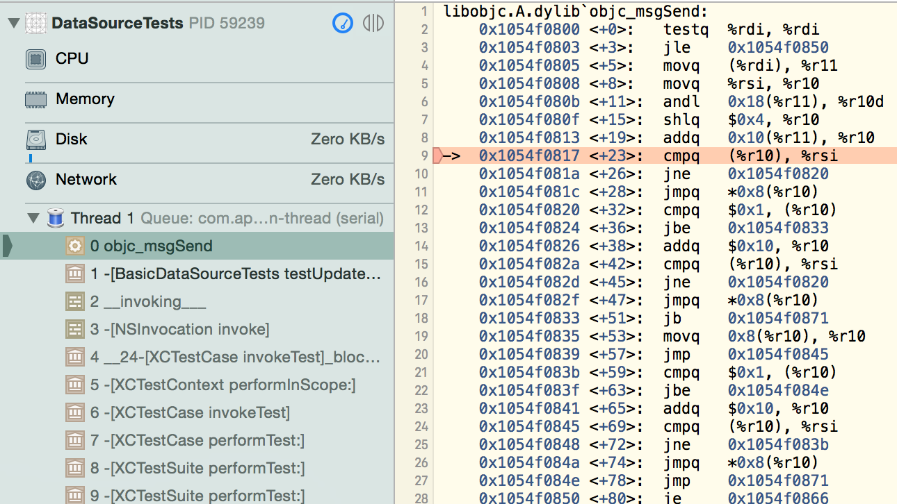
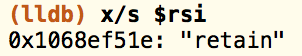
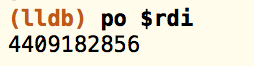
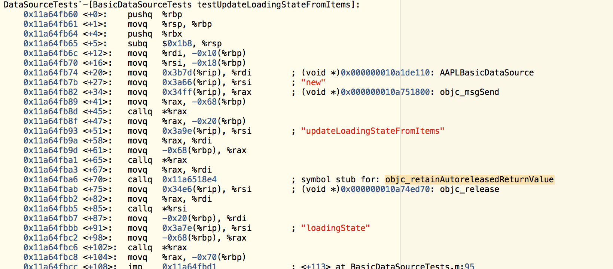

#### A Lesson in ARC and Assembly

We recently upgraded to Xcode 7. That is when our automated UI tests started crashing.



Looking at the crash, it was obvious that a `EXC_BAD_ACCESS` was occuring in `objc_msgSend`. There was no information in the `lldb` console.

This where I started using `lldb` commands. The first thing I did was run `x/s $rsi` to determine that the message `"retain"` was being sent.



I tried to find out which object was being sent the `"retain"` message, but it only printed out the memory address.



I stepped into the function, and did not see anything odd with variables or memory.

```objective-c
- (void)updateLoadingStateFromItems
{
    NSString *loadingState = self.loadingState;
    NSUInteger numberOfItems = [_items count];
    if (numberOfItems && [loadingState isEqualToString:AAPLLoadStateNoContent])
        self.loadingState = AAPLLoadStateContentLoaded;
    else if (!numberOfItems && [loadingState isEqualToString:AAPLLoadStateContentLoaded])
        self.loadingState = AAPLLoadStateNoContent;
}
```

My next thought was, "perhaps there is an object that is being corrupted so that it is no longer valid and it is at that memory address".

I wasn't sure how to determine which object was being overwritten. So, I enabled, `MallocScribble`, `MallocStackLogging`, `MallocStackLoggingNoCompact`, and `MallocGuardEdges`. I re-ran and no information was printed to the console when the crash occurred. As I understand how this works, I should have seen something if memory had been smashed.

So, I stepped back. The crash only occurred after I stepped out of the call and tried to step to the next instruction.

So, something was happening. What was being retained? I didn't see any reason for a `retain` call.

I reviewed how ARC works under the hood. The compiler was inserting the retain. Why? At what point?

I then set a breakpoint at the point of the call to `updateLoadingStateFromItems` and opened up the Assistant Editor with the Disassembly view. There, I saw the disassembly for the function where the crash was occurring.



Sure enough, I saw the call `objc_retainAutoreleasedReturnValue` had been inserted. This meant that there was a return value that was being retained by the `autorelease` call.

Looking at the function, it has no return value. Odd. Supposedly, according to the disassembly, there is a value being retained. Where is this coming from?

Hm. This method is not exposed in the header, we've created a Testing category for the Class.

```objective-c
@interface AAPLBasicDataSource (Testing)
- (NSString *)updateLoadingStateFromItems;
@end
```

Aha, we've declared the method at the top of this testing file but the return type is `NSString *` instead of `void`. Probably the implementation changed and the test was not updated.

The quick fix is to update the exposed method in the `Testing` Category to match the actual implementation. No return type, no crash as the compiler didn't create a retain on a non-object.

The correct fix would be to refactor the code so that there is one "true" definition of the method.

***

To learn more, here are the articles that I referenced:
- [Examining Memory](https://sourceware.org/gdb/onlinedocs/gdb/Memory.html)
- [Tales From The Crash Mines: Issue #1](https://www.mikeash.com/pyblog/tales-from-the-crash-mines-issue-1.html)
- [Understanding C by learning assembly](https://www.recurse.com/blog/7-understanding-c-by-learning-assembly)
- [How does objc_retainAutoreleasedReturnValue work?](http://www.galloway.me.uk/2012/02/how-does-objc_retainautoreleasedreturnvalue-work/)
